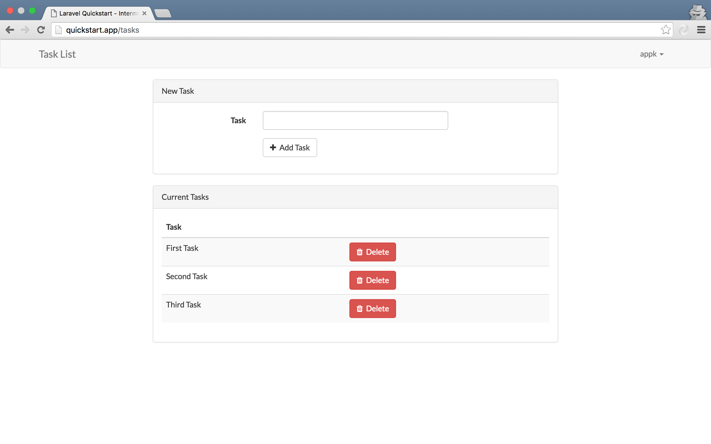

# Laravel Quickstart - Intermediate - Task List With Authentication (On Docker)

This project is a fork of [Laravel's official tutorial](https://laravel.com/docs/5.2/quickstart-intermediate) to configure and test docker environment. For docker containers, I used forked version of [LaraDock project](https://github.com/LaraDock/laradock).

## 1. Install Docker Toolbox

OSes other than Mac, refer to the docker manual.

```sh
$ brew cask install dockertoolbox --appdir=/Applications
```

## 2. Create Virtual Machine

This is just a clean VM where the other docker containers will sit on.

```sh
$ docker-machine create quickstart --drivier virtualbox
```

Takes about 1 min.

> To stop & start the VM.
>
> ```sh
> $ docker-machine stop quickstart
> $ docker-machine start quickstart
> ```

## 3. Configure the Host File

Get the VM's IP address.

```sh
$ docker-machine ip quickstart
# 192.168.99.100
```

Add the host record in `/etc/hosts`. I named it `quickstart.app`

```sh
# /etc/hosts

192.168.99.100	quickstart.app
```

## 4. Clone the Project & Do the Initialization

Clone this project & checkout the forked version of LaraDock(which contains Docker container defination & docker-compose.yml)

```sh
~ $ git clone git@github.com:appkr/quickstart-intermediate.git quickstart && cd quickstart
~ $ git submodule init && git submodule update
```

Just as usual..

```sh
~/quickstart $ composer install
~/quickstart $ chmod 775 storage bootstrap/cache
~/quickstart $ php artisan key:generate
```

## 5. Boot-up the Docker Containers

For available containers, read the [official document from LaraDock](https://github.com/LaraDock/laradock). I booted only nginx and mysql.

`eval` part is important. It tells `docker-compose` that the base infra(VM) we will use is `quickstart`.

```sh
~/quickstart $  cd laradock
~/quickstart/laradock $ eval $(docker-machine env quickstart)
~/quickstart/laradock $ docker-compose up -d nginx mysql
```

It takes 5 to 10 mins, depending on the network speed.

```sh
~/quickstart/laradock $ docker-compose ps
#          Name                      Command             State                     Ports
# --------------------------------------------------------------------------------------------------------
# laradock_application_1   true                          Exit 0
# laradock_data_1          true                          Exit 0
# laradock_mysql_1         docker-entrypoint.sh mysqld   Up       0.0.0.0:3306->3306/tcp
# laradock_nginx_1         nginx                         Up       0.0.0.0:443->443/tcp, 0.0.0.0:80->80/tcp
# laradock_php-fpm_1       php-fpm                       Up       9000/tcp
# laradock_workspace_1     /sbin/my_init                 Up
```

> To stop the containers
>
> ```sh
> ~/quickstart/laradock $ docker-compose stop
> # OR
> ~/quickstart/laradock $ docker-compose down
> ```
>
> While `down` completely removes your changes on the system, `stop` retains them. So, when `up` after `down` command, completely new containers are generated.

## 6. Login to the Container

To SSH into the container...

```sh
~/quickstart/laradock $ docker-compose run workspace bash
# OR
~/quickstart/laradock $ docker exec -it laradock_workspace_1 bash

root@6501a8c342d6:/var/www/laravel \# hostname
# 6501a8c342d6
```

Note this. While `docker-compose run` references the name in `docker-compose.yml`, `docker exec` references the generated container name.

## 7. Database Migration and Test

```sh
root@6501a8c342d6:/var/www/laravel \# php artisan migrate
root@6501a8c342d6:/var/www/laravel \# vendor/bin/phpunit
```

Open `http://quickstart.app`.



That's it.
